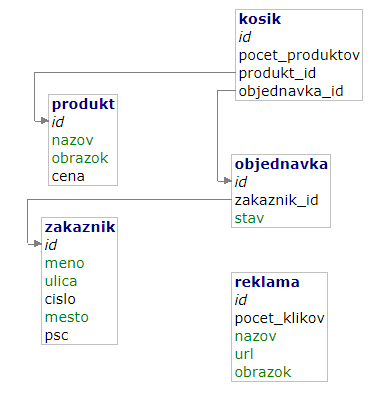

# Eshop - VAJVS - Peter Stríž

React frontend: ```http://localhost:3000/```

Node server:  ```http://localhost:8081/```

Adminer: ```http://localhost:8080/```

Názov databázy: ```eshop```

(Treba mať vypnutý adblocker v prehliadači, inak sa niektoré funkcie nemusia zobraziť správne)


## Spustenie

Treba použiť dve konzoly naraz, lebo jedna rieši Docker, zatiaľ čo tá druhá React

Príkazy môžeme spúšťať súbežne

1. Konzola - *Node server, Adminer, Databáza*
```
docker-compose build
docker-compose up
(počkať pokiaľ sa načíta mysql databáza -> zrušiť CTRL+C)
docker-compose up 
```
2. Konzola - *React*
```
cd ./my-app/
npm install
npm start
```

## Testy

V root priečinku stačí spustiť:

```
npm test
```


## Databáza


